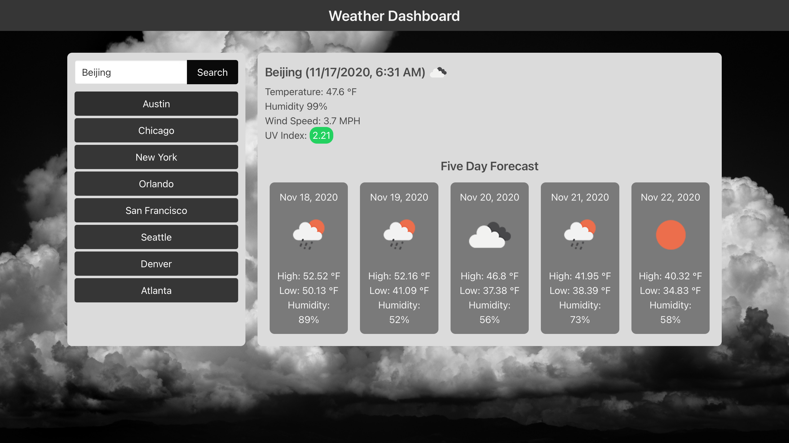

# Weather Dashboard

## Description

Weather Dashboard that displays the current weather and five-day forecast. When the document loads to the browser, the application automatically renders weather data for the user's current location. The user may also search for a location or choose to select a major city located under the search bar with the latter option being unavailable for small screen sizes.

[View deployed project](https://jkole822.github.io/Weather-Dashboard)

## Visuals

### Display on Large Screens

### Display on Small Screens

